# ☁️ Awesome Hybrid Cloud Storage Gateway 💾

  

## 🌐 Top Hybrid Cloud Storage Gateway Ecosystem

> 📌 **Curated Directory of Commercial SaaS Platforms & Open-Source Projects**  
> *Focused on Cloud Data Tiering, Global File Systems, S3 Application Gateways & Self-Hosted NAS Infrastructure*  
> 🗓️ **Last updated: October 2026**

---

### 🚀 Overview & Intent

This repository tracks notable **commercial hybrid cloud storage gateway platforms** and **open-source storage engines** that seamlessly bridge on-premises data centers, edge appliances, and local NAS/SAN arrays with public cloud object storage (AWS S3, Azure Blob, Google Cloud Storage). 

These solutions provide **local high-speed caching**, **global file locking**, **cross-region replication**, and **automated hot/cold data tiering** for distributed enterprises and cloud-native architects.

---

## 📑 Table of Contents

- [☁️ Commercial SaaS / Hosted Platforms](#-commercial-saas--hosted-platforms)
- [⚡️ Open-Source GitHub Projects](#-open-source-github-projects)
- [🛠️ Architectural Frameworks & Selection Guide](#️-architectural-frameworks--selection-guide)
- [🤝 How to Contribute](#-how-to-contribute)
- [⚠️ Disclaimer](#️-disclaimer)
- [📈 Star History](#-star-history)
- [💖 Support & Sponsorship](#-support--sponsorship)

---

## ☁️ Commercial SaaS / Hosted Platforms

> 📊 **Market Overview & Industry Structure**: The global hybrid cloud storage gateway and enterprise data tiering market is estimated at **$12.5 Billion (2026)**, expanding at a **~17.8% CAGR**. The sector is **moderately fragmented**: cloud hyperscalers (AWS, Azure) command the baseline gateway and object tiering infrastructure, while enterprise storage specialists (NetApp, Pure Storage, Nasuni, Panzura, CTERA) hold strong domain dominance in global file systems, multi-site file locking, WAN optimization, and zero-trust ransomware protection.

Below is the comparative list of commercial SaaS products, sorted descending by **Company Size (Annual Revenue / Valuation)**:

| Platform & Link | Company Size (Revenue / Valuation) 📊 | Description & Best For 🎯 | Specific Pricing 💵 | Free Tier / Trial Limit 🎁 |
| :--- | :--- | :--- | :--- | :--- |
| **[AWS Storage Gateway](https://aws.amazon.com/storagegateway/)** ☁️ | **~$575B+ Rev** / ~$2.1T Market Cap | **AWS hybrid cloud storage service** providing S3 File (NFS/SMB), Volume (iSCSI), and Tape gateways with local LRU caching. Best for AWS-native hybrid storage. | **$0.01 / GB written** (capped at $125/gateway/mo) + standard S3 storage fees ($0.023/GB/mo) | **100 GB written** to AWS per account free forever (Always Free) |
| **[Azure Stack Edge](https://azure.microsoft.com/en-us/products/azure-stack/edge/)** 🔷 | **~$245B+ Rev** / ~$3.1T Market Cap | **Managed edge computing & storage gateway** device with AI acceleration and Azure Blob/File integration. Best for Azure-native hybrid edge storage. | Starts at **~$399 / month** hardware subscription fee + standard Azure Blob storage charges | **No hardware trial** (Azure cloud account provides 30-day / $200 credit for cloud services only) |
| **[NetApp Cloud Volumes ONTAP](https://www.netapp.com/cloud/)** 💙 | **~$6.2B Rev** / ~$22B Market Cap | **Enterprise NAS & block storage** combining ONTAP data management (NFS, SMB, iSCSI) with cloud elasticity. Best for enterprise workloads needing NetApp features. | Starts at **$0.64 / hour** (Explore tier, up to 2TB) or ~$0.10 / GB-month payload capacity | **Freemium plan free forever** up to 500 GiB provisioned capacity (or 30-day trial with unmetered capacity) |
| **[Pure Storage Cloud Block Store](https://www.purestorage.com/)** 🟧 | **~$2.8B Rev** / ~$18B Market Cap | **Cloud block storage platform** enabling workload portability across AWS and Azure with thin provisioning. Best for Pure Storage ecosystem users. | Starts at **~$80 – $90 / TB / month** based on Effective Used Capacity (EuC) + cloud infra | **30-day free trial** available via AWS / Azure Marketplace listings |
| **[Cohesity SmartFiles](https://www.cohesity.com/)** 🛡️ | **~$550M Rev** / ~$3.0B Valuation | **Software-defined scale-out file & object platform** for enterprise data consolidation. Best for file data management and backup consolidation. | Starts at **~$150 – $400+ / TB / year** backend capacity (or ~$731 / TB / year list unit) | **30-day free trial** for cloud platform services (no perpetual free tier) |
| **[Qumulo Core](https://qumulo.com/)** 🟢 | **~$115M ARR** / ~$1.2B Valuation | **Scale-out file storage system** with real-time data analytics, NFS, SMB, and S3 access. Best for media, HPC, and life sciences workloads. | **$0.009 to $0.026 / GB-month** (~$9.22 to $26.62 / TB-month) for cloud software + AWS/GCP infra | **30-day cloud trial** (with 1TB / 12TB trial editions on AWS Marketplace) |
| **[Nasuni File Data Platform](https://www.nasuni.com/)** 🌐 | **~$100M+ ARR** / ~$1.2B Valuation | **Cloud-native file service platform** replacing legacy NAS and backup with cloud-scale global file locking. Best for multi-site file consolidation. | Starts at **~$850 – $1,050 / TB / year** subscription license fee | **14-day free trial** with up to **5 TB** licensed data limit |
| **[Panzura CloudFS](https://panzura.com/)** ⚡️ | **~$42M ARR** / ~$350M Valuation | **Global cloud file system** with 60s snapshot RPO, global deduplication, and ransomware protection. Best for multi-site file collaboration. | Starts at **~$276.12 / TB / year** (CloudFS Archive) or **$840 / TB / year** (NAS tier) on AWS Marketplace | **No free tier** (Custom interactive demo & TCO assessment provided upon request) |
| **[CTERA Enterprise File Services](https://www.ctera.com/)** 🔒 | **~$25M-$50M ARR** / ~$250M Valuation | **Global file system & gateway** with WAN optimization, endpoint backup, and edge filers. Best for distributed enterprise file services. | Starts at **~$1,200 / node / year** (or custom AWS/Azure private marketplace offer) | **30-day free trial** with full platform evaluation license |
| **[Lucidity](https://www.lucidity.cloud/)** 🚀 | **~$19M ARR** / ~$50M-$100M Valuation | **Autonomous cloud storage auto-scaler** providing automatic block storage expansion/shrinking for EBS disks. Best for cloud storage cost optimization. | Percentage of storage savings (~15-30% of reclaimed EBS costs) / customized software subscription | **Free storage audit tool** & no-commitment storage assessment + 14-day demo trial |

---

## ⚡️ Open-Source GitHub Projects

Below is the expanded list of open-source storage gateway repositories, distributed file systems, and S3 translators, sorted descending by **GitHub Stars_Count**:

1. **[MinIO](https://github.com/minio/minio)**  — **61,335 ⭐**  
   High-performance, S3-compatible enterprise object storage built for cloud-native hybrid infrastructure. **Best for S3-compatible object storage**.

2. **[Rclone](https://github.com/rclone/rclone)**  — **60,168 ⭐**  
   "rsync for cloud storage" — command-line utility to sync, encrypt, and mount files across 70+ cloud storage providers with VFS caching. **Best for universal cloud data sync & mounts**.

3. **[restic](https://github.com/restic/restic)**  — **36,459 ⭐**  
   Fast, secure, encrypted backup program supporting local drives and cloud object storage gateways (S3, Azure Blob, SFTP). **Best for secure, deduplicated cloud backups**.

4. **[SeaweedFS](https://github.com/seaweedfs/seaweedfs)**  — **35,293 ⭐**  
   Fast distributed storage system for billions of files with S3 API, POSIX layer, and tiering to cloud storage. **Best for large-scale file & object storage**.

5. **[Ceph](https://github.com/ceph/ceph)**  — **17,097 ⭐**  
   Unified distributed object store, block device, and file system delivering enterprise storage infrastructure for private & hybrid clouds. **Best for unified infrastructure storage**.

6. **[JuiceFS](https://github.com/juicedata/juicefs)**  — **14,505 ⭐**  
   POSIX file system built on top of Redis/SQL and cloud object storage (S3/Azure Blob/GCS) with high-performance local caching. **Best for POSIX cloud file systems & AI/ML training data**.

7. **[OpenZFS](https://github.com/openzfs/zfs)**  — **12,475 ⭐**  
   Enterprise file system and volume manager with pooled storage, data integrity verification, copy-on-write snapshots, and cloud tiering capabilities. **Best for file system integrity & storage pooling**.

8. **[OpenEBS](https://github.com/openebs/openebs)**  — **9,825 ⭐**  
   Leading Container Attached Storage (CAS) solution for Kubernetes, providing persistent block storage across cloud & edge nodes. **Best for Kubernetes cloud-native storage**.

9. **[Longhorn](https://github.com/longhorn/longhorn)**  — **8,018 ⭐**  
   Cloud-native distributed block storage built for Kubernetes with incremental snapshots and multi-cloud disaster recovery. **Best for Kubernetes persistent volume backups**.

10. **[GlusterFS](https://github.com/gluster/glusterfs)**  — **5,255 ⭐**  
    Scalable network-attached storage file system with no-metadata server architecture. **Best for scale-out NAS & block storage**.

11. **[MooseFS](https://github.com/moosefs/moosefs)**  — **2,006 ⭐**  
    Open-source distributed NAS supporting up to 16 exabytes and 2 billion files per cluster with POSIX compliance. **Best for media production and HPC workloads**.

12. **[NetApp Trident](https://github.com/NetApp/trident)**  — **879 ⭐**  
    Open-source storage orchestrator for Kubernetes, supporting ONTAP NFS/iSCSI and hybrid storage backends. **Best for enterprise Kubernetes persistent storage**.

13. **[TrueNAS / FreeNAS](https://github.com/truenas/webui)**  — **540 ⭐**  
    Open-source storage OS with ZFS, SMB/NFS/iSCSI support, and container integration for self-hosted hybrid NAS deployments. **Best for self-hosted NAS with ZFS**.

14. **[NooBaa](https://github.com/noobaa/noobaa-core)**  — **364 ⭐**  
    High-performance S3 application gateway connecting file systems, object storage, and multi-clouds with caching and replication. **Best for hybrid & multi-cloud object storage gateways**.

15. **[Vaultaire](https://github.com/fairforge/vaultaire)**  — **3 ⭐**  
    Universal storage orchestration engine providing unified S3 API across multiple backends with intelligent tiering and audit trails. **Best for multi-cloud storage orchestration**.

16. **[gfeh](https://github.com/town-os/gfeh)**  — **0 ⭐**  
    Multi-protocol VFS layer for object storage featuring read-through caching and two-way mirroring. **Best for unified object storage access**.

---

## 🛠️ Architectural Frameworks & Selection Guide

To assemble a customized hybrid cloud storage gateway architecture using open-source components:

- **Universal S3 Multi-Cloud Orchestration**: Combine **Vaultaire** for a unified S3 API with hot/cold tiering across Wasabi, Cloudflare R2, and Backblaze B2.
- **S3 Gateway & Replication**: Deploy **NooBaa** for object abstraction, read-through caching, and dynamic multi-cloud replication.
- **POSIX Cloud File System for AI/ML**: Utilize **JuiceFS** or **SeaweedFS** with local NVMe caching to turn object storage into high-throughput file shares.
- **Multi-Protocol VFS Access**: Integrate **gfeh** for read-through caching and two-way mirroring between local nodes and S3.
- **Exabyte-Scale Distributed NAS**: Deploy **MooseFS** or **Ceph** for POSIX-compliant scale-out storage across commodity hardware.
- **Kubernetes Cloud-Native Storage**: Pair **OpenEBS**, **Longhorn**, or **NetApp Trident** for persistent stateful volume management.

---

## 🤝 How to Contribute

Contributions are welcome! Please follow these simple guidelines:

1. Fork this repository.
2. Add or update entries in `README.md` maintaining alphabetical or star-based sorting formats.
3. Include the project name, official/repo link, a concise 1-2 sentence description, pricing/star metrics, and key category tags.
4. Submit a Pull Request (PR) with a short description of the added product or project.

Check out our curated awesome index: .

---

## ⚠️ Disclaimer

- This directory is a **community-curated list** for informational and educational purposes — not an exhaustive vendor list or explicit commercial endorsement.
- Hybrid cloud storage gateways manage sensitive enterprise data. Self-hosted and open-source deployments require proper network security hardening, encryption at rest and in transit, strict RBAC controls, and compliance with privacy regulations (GDPR, HIPAA, SOC 2).
- **Cache Sizing**: For AWS S3 File Gateway and local edge filers, local cache allocation is critical — start with at least 150 GiB NVMe/SSD cache and scale according to CloudWatch/Prometheus I/O metrics.

---

## 📈 Star History

---

## 💖 Support & Sponsorship

Thank you for exploring the **Awesome Hybrid Cloud Storage Gateway** ecosystem! 🚀 

If you find this repository valuable for your storage architecture research, cloud migration planning, or open-source infrastructure projects, please consider supporting us:

- ⭐️ **Star** this repository to help other storage engineers discover it.
- 🔀 **Fork** and contribute new enterprise tools or open-source gateways.
- 📢 **Share** it with your network, DevOps teams, and cloud architects.
- ☕️ **Sponsor / Buy me a coffee**: Support ongoing research and repo maintenance via [GitHub Sponsors](https://github.com/sponsors/ishandutta2007).

---

**Made with ❤️ for storage engineers, cloud architects, and data infrastructure teams worldwide.**
